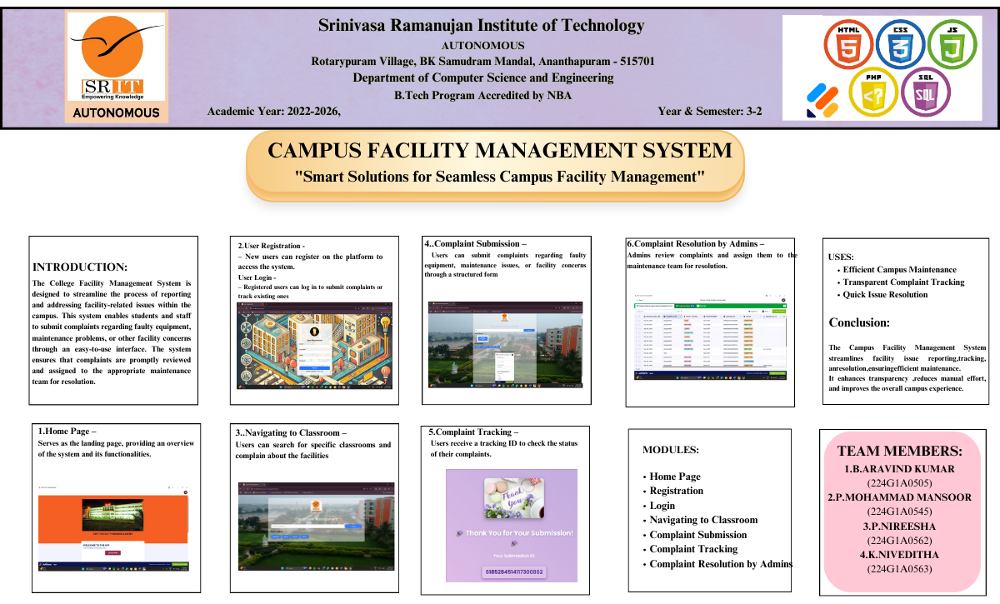
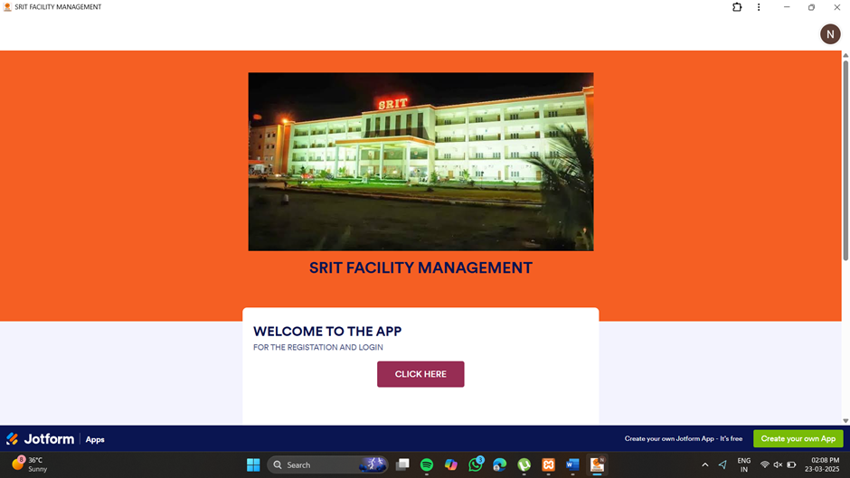
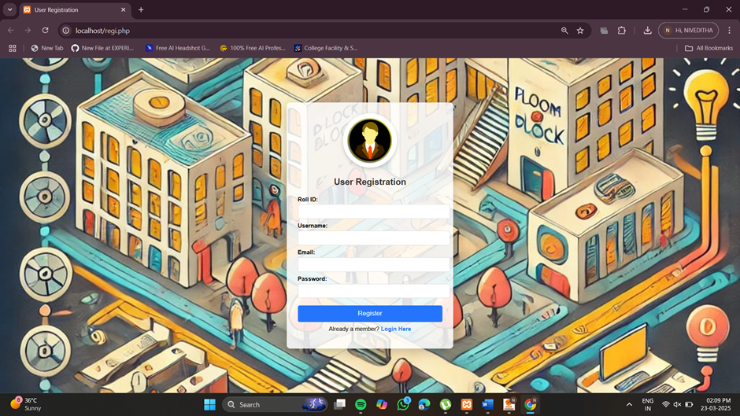
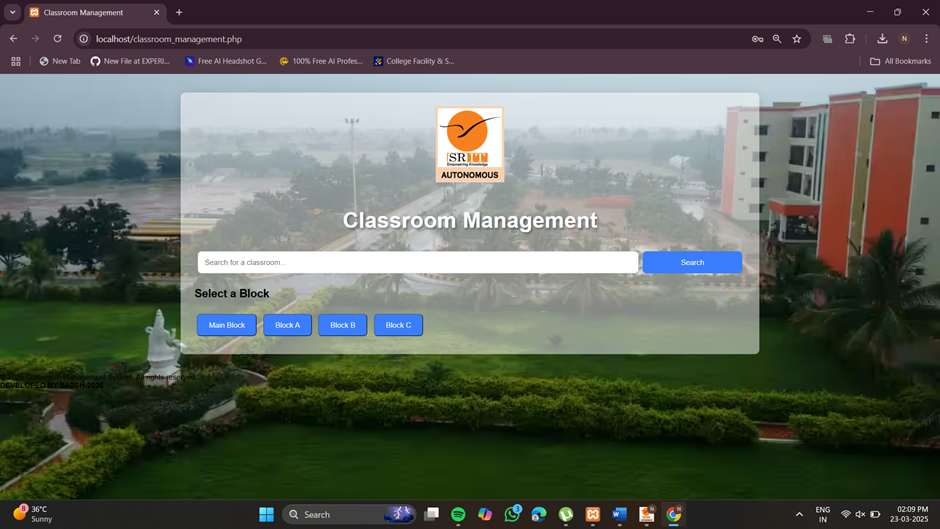
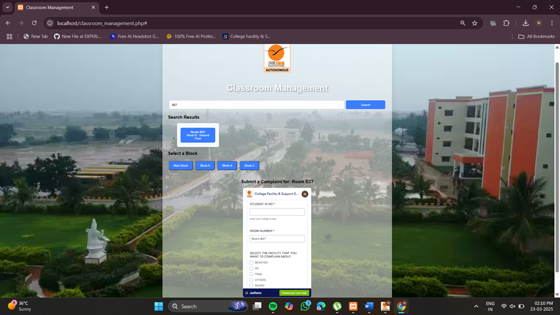
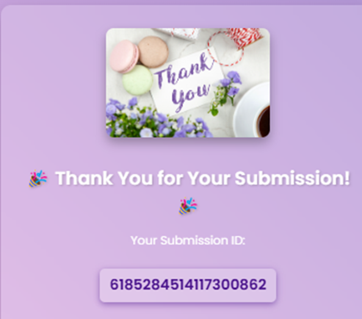
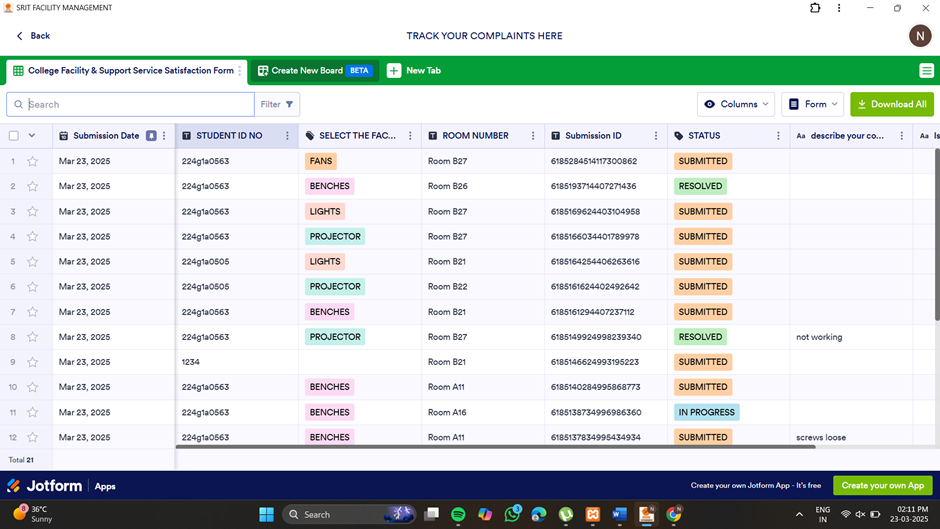

# 🎓 CAMPUS FACILITY MANAGEMENT SYSTEM

**"Smart Solutions for Seamless Campus Facility Management"**

---

## 📌 Introduction 

The system streamlines the process of reporting and resolving facility-related issues within a college campus. It enables students and staff to:

- Register and log in to their accounts  
- Search for their respective classrooms  
- Submit complaints about maintenance or infrastructure issues  
- Track the complaint status until resolution  

This project focuses on improving campus life by providing a transparent, efficient complaint management system.

---

## 🔄 Workflow

1. **User Registration**  
   New users register to access the platform.

2. **Login**  
   Registered users log in to access the dashboard.

3. **Search Classroom**  
   Users find their classrooms in the system.

4. **Submit Complaint**  
   Users submit facility-related complaints via a friendly interface.

5. **Track Complaint**  
   Users monitor complaint status with a unique tracking ID.

---

## 📲 Modules

- Home Page  
- User Registration  
- User Login  
- Classroom Search  
- Complaint Submission  
- Complaint Tracking  
- Admin Complaint Resolution

---

## 🛠️ Tech Stack

---

## ✅ Features

- Easy classroom search functionality  
- Structured complaint submission process  
- Complaint tracking with unique tracking ID  
- Admin panel for complaint resolution  
- Secure login with role-based access

---

## 🎯 Benefits

- Efficient Campus Maintenance  
- Transparent Complaint Tracking  
- Quick Issue Resolution  
- Improved Campus Experience

---

## 👨‍💻 Team Members and Roles

| Name               | Roll Number   | Role                            |
|--------------------|---------------|---------------------------------|
| N. Niveditha       | 224G1A0563    | Team Lead, Backend & Database   |
| B. Aravind Kumar   | 224G1A0505    | User Authentication & Backend   |
| P. Mohammad Mansoor| 224G1A0545    | Project Coordinator & Tester    |
| P. Nireesha        | 224G1A0562    | Frontend Developer & UI/UX      |

---

## 📸 Snapshots

|  (Registration) | (Login) | (Classroom Search) |
|----------------------|--------------|-------------------------|
|  |  |  |

|  (Complaint Submission) | (Tracking Complaint) | (Admin Dashboard) |
|-----------------------------|---------------------------|-------------------------|
|  |  |  |

---
